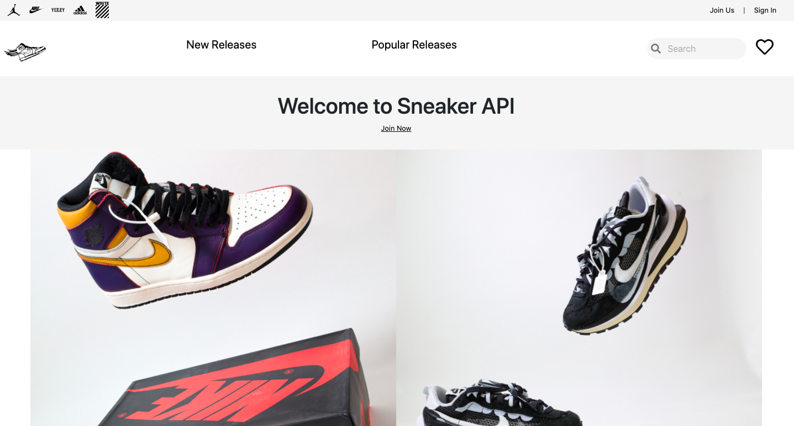

# [Sneaker API](https://sneaker-api-htx.herokuapp.com/)
## [www.sneakerapi.io](www.sneakerapi.io)
### Original Log

### New Logo

## Created by: Dominique Hosea

### November 2020

<!-- Link to the project via heroku -->
I have always had an interest in sneakers. In the process of making projects I wanted to make a sneaker application using a 3rd party API but I discovered there weren't any API's or there weren't any that were accessible at the time.

Sneaker API produces JSON data with descriptions, images, prices and release dates of the most popular sneakers. You can make HTTP request to my API to get the JSON data. On the home page you can see some of the sample JSON data if you click the submit button.

## Homepage 
---

### Original

### New

## Technologies Used

This application was developed with Node.js, EJS, Vanilla JavaScript, jQuery and styling with CSS.

M - MongoDB to store data  
E - Express, a back-end framework  
EJS - renders client side views  
N - NodeJS - to run back end service

other dependencies used:

- Morgan - HTTP request logger middleware for node.js
- Mongoose - for MongoDB validation
- Body Parser - handles user-controlled inpu
- Dotenv - stores configuration in the environment separate from code is based on The Twelve-Factor App methodology

## External APIs Used
---
## [MainChimp](https://mailchimp.com/developer/marketing/api/root/)
- Mailchimp manages your audiences, integrate your data, and send timely, relevant email campaigns.

---

## Click this link here to go to [Sneaker-API](https://sneaker-api-htx.herokuapp.com/)

---

## Getting Started
---

SneakerAPI is a REST API that serves the latest sneaker information. It can be used without any API token, membership, registration or payment. It supports a variety of filters that can be applied to get the sneaker of your choice. The usage only requires basic knowledge of HTTP requests and JSON.

## Data Structure
---

### Model

### Routes
API - Routes

### Controllers 

### Views 

### JavaScript Functions

	

## Future Enhancements	
---

- Add user login 	- Additional styling
- Create a UI for delete and edit

